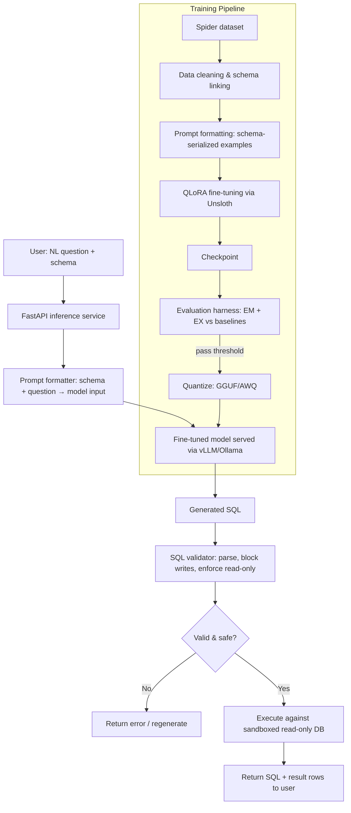

# QueryForge — A Fine-Tuned Text-to-SQL Specialist Model

Fine-tuning a small open-weight LLM to outperform prompted frontier models on schema-grounded natural-language-to-SQL generation — with a rigorous, contamination-checked evaluation harness to prove it.

> **Status:** 🚧 In development — see [Roadmap](#roadmap) for current stage.

---

## Why This Project

This project asks a narrower, more defensible question:

> **Can a small, fine-tuned open-weight model beat a prompted general-purpose model on a fixed, schema-grounded SQL generation task — at a fraction of the inference cost?**

Everything here is built to answer that question honestly: a real held-out evaluation set, execution-based scoring (not just string matching), and an explicit accounting for data contamination — a mistake that has publicly tripped up even well-resourced fine-tuning attempts.

## Problem Statement

Given:
- A natural language question (e.g. *"What are the names of students older than 20 enrolled in the Physics department?"*)
- A database schema (tables, columns, foreign keys — no data rows)

Produce a syntactically valid, semantically correct SQL query that answers the question when executed against that schema.

This is evaluated two ways:
1. **Exact Set Match (EM)** — does the generated query match the gold query structurally (ignoring literal ordering)?
2. **Execution Accuracy (EX)** — does running the generated query against the actual database return the same result set as the gold query? *(This is the primary metric — a query can be phrased differently from the gold query and still be correct.)*

## Architecture



**Design principles:**
- **Read-only execution, always.** Generated SQL is parsed and validated before execution; any `INSERT`/`UPDATE`/`DELETE`/`DROP` is rejected outright, and the execution sandbox uses a read-only DB role regardless.
- **Execution accuracy over string matching.** A model shouldn't be penalized for a correct query phrased differently from the gold query — so EX (does it return the right rows?) is the primary metric, not just EM.
- **No orphaned inference logic.** The prompt format used at training time is exactly what's used at serving time — no drift between how the model was trained and how it's called in production.

## Dataset

**[Spider 1.0](https://yale-lily.github.io/spider)** — a cross-domain, schema-grounded text-to-SQL benchmark: ~200 databases across dozens of domains, ~10K natural language question/SQL pairs, with an official train/dev split designed so dev-set databases are unseen during training.

**Data contamination guardrail:** the official Spider split is respected exactly — no dev-set database schema is allowed to leak into the training set, even indirectly through similar questions on the same schema. This is checked programmatically before training starts (see `data/validate_split.py`), not just assumed. This check exists because a well-known public fine-tuning attempt (PewDiePie's coding-model project) ran into exactly this failure mode — inflated validation metrics from test-split leakage — and it's cheap to avoid if checked explicitly.

## Methodology

1. **Data preparation**
   - Serialize each schema into a compact text format (table names, columns, types, foreign keys) prepended to the question.
   - Format as instruction-tuning pairs: `(schema + question) → SQL`.
   - Deduplicate near-identical examples; validate the train/dev split boundary.
   - Version the processed dataset with DVC.

2. **Fine-tuning**
   - Base model: **Qwen2.5-Coder-7B-Instruct** (code-specialized, strong SQL prior, fits QLoRA on a single free-tier GPU). Note the version-alignment lesson from the PewDiePie project directly: fine-tune the *coder-specialized* variant, not the general base model.
   - Method: **QLoRA** (4-bit base weights + LoRA adapters) via **Unsloth** for memory-efficient training.
   - Tracked with Weights & Biases: loss curves, learning rate schedule, and periodic held-out EX checks during training (not just at the end).

3. **Evaluation**
   - Metrics: Exact Set Match and Execution Accuracy on the official Spider dev set.
   - Baselines to compare against:
     - Base model, zero-shot prompted (no fine-tuning)
     - Base model, few-shot prompted
     - A frontier model (e.g. GPT-4o or Claude), few-shot prompted on the same schemas
   - Report accuracy **alongside** inference latency and estimated per-query cost — the fine-tuned model's case rests on the cost/latency tradeoff as much as raw accuracy.

4. **Deployment**
   - Quantize the fine-tuned adapter-merged model to GGUF (llama.cpp-compatible) or AWQ.
   - Serve via vLLM (or Ollama for lighter local demo) behind a FastAPI wrapper.
   - Dockerized for reproducible deployment.
   - GitHub Actions CI: runs the evaluation harness against any new checkpoint before it's allowed to replace the "production" model artifact — a lightweight regression gate, not full retraining automation.

## Tech Stack

| Layer | Tools |
|---|---|
| Base model | Qwen2.5-Coder-7B-Instruct |
| Fine-tuning | Unsloth, QLoRA, PEFT, bitsandbytes |
| Experiment tracking | Weights & Biases |
| Data versioning | DVC |
| Evaluation | Custom harness (EM + EX), sqlite/PostgreSQL execution sandbox |
| Quantization | GGUF (llama.cpp) / AWQ |
| Serving | vLLM or Ollama, FastAPI |
| Deployment | Docker, GitHub Actions |

## Repository Structure

```
queryforge/
├── data/
│   ├── download_spider.py
│   ├── preprocess.py           # schema serialization + prompt formatting
│   ├── validate_split.py       # contamination guardrail check
│   └── queryforge.dvc          # DVC-tracked processed dataset
├── training/
│   ├── train_qlora.py
│   ├── config.yaml              # LoRA rank/alpha, lr, epochs, etc.
│   └── merge_adapter.py
├── evaluation/
│   ├── run_eval.py               # EM + EX scoring
│   ├── baselines.py               # zero/few-shot + frontier-model comparison
│   └── report.py                  # results table + cost/latency comparison
├── serving/
│   ├── app.py                    # FastAPI inference endpoint
│   ├── sql_validator.py           # read-only enforcement, query parsing
│   └── Dockerfile
├── .github/workflows/
│   └── eval-gate.yml               # CI regression check on new checkpoints
├── notebooks/                       # exploration, error analysis
├── requirements.txt
└── README.md
```

## Results

> To be filled in after training. Reporting both metrics transparently — including failure cases — rather than only the best run, per the lesson from the PewDiePie fine-tuning attempt (a one-off high score that couldn't be reproduced isn't a result).

| Model | Exact Match | Execution Accuracy | Avg. Latency | Est. Cost / 1K queries |
|---|---|---|---|---|
| Base model (zero-shot) | TBD | TBD | TBD | TBD |
| Base model (few-shot) | TBD | TBD | TBD | TBD |
| **Fine-tuned (ours)** | TBD | TBD | TBD | TBD |
| Frontier model (few-shot, reference) | TBD | TBD | TBD | TBD |

## Setup

```bash
git clone https://github.com/MdHananSjd/queryforge.git
cd queryforge
pip install -r requirements.txt

# Download and prepare Spider
python data/download_spider.py
python data/preprocess.py
python data/validate_split.py   # confirms no train/dev leakage

# Fine-tune
python training/train_qlora.py --config training/config.yaml

# Evaluate
python evaluation/run_eval.py --checkpoint <path> --baselines all
```

## Usage

```bash
# Serve the fine-tuned model
docker compose up

# Query the API
curl -X POST http://localhost:8000/query \
  -H "Content-Type: application/json" \
  -d '{
        "question": "What are the names of students older than 20 enrolled in the Physics department?",
        "schema_id": "college_2"
      }'
```

## Roadmap

- [ ] Data pipeline + contamination validation
- [ ] QLoRA fine-tuning (v1)
- [ ] Evaluation harness (EM + EX) + baseline comparisons
- [ ] Quantized deployment via vLLM/Ollama
- [ ] FastAPI serving layer + SQL safety validation
- [ ] Docker + CI eval gate
- [ ] Results write-up with full baseline comparison table

## Acknowledgments

- [Spider dataset](https://yale-lily.github.io/spider) (Yale LILY Lab)
- [Unsloth](https://github.com/unslothai/unsloth) for efficient QLoRA fine-tuning
- Qwen2.5-Coder model family
